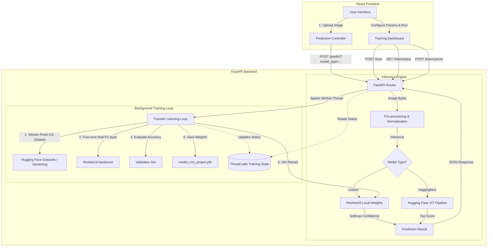

# FoodSnap AI: Food Recognition & Real-Time Transfer Learning

FoodSnap AI is a full-stack web application designed for automatic food image classification and real-time model training. Powered by a **React/Vite** frontend and a **FastAPI** backend, the project combines state-of-the-art deep learning models with an interactive transfer learning interface.

Users can choose between a **local fine-tuned CNN model (ResNet18)** or a **Hugging Face Vision Transformer (ViT)** to classify images from the 101 categories in the Food-101 dataset.

---

## 🌟 Key Features

*   **Dual-Model Inference Engine**:
    *   **Custom CNN (ResNet18)**: Runs inference locally using a PyTorch model (`model_cnn_project.pth`) fine-tuned via transfer learning.
    *   **Vision Transformer (ViT)**: Lazy-loads and runs the high-accuracy `nateraw/vit-base-food101` model directly from Hugging Face.
*   **Live Background Training Dashboard**:
    *   Configure hyperparameters (Epochs, Batch Size, Learning Rate, Subset Sizes) directly from the UI.
    *   Initiate real-time background training tasks using PyTorch and FastAPI `BackgroundTasks`.
    *   Stream dataset loading directly from Hugging Face (loading on-the-fly to avoid a 5GB full download) or fall back to synthetic data when offline.
    *   Poll live metrics (Epoch progress, Loss curves, and Test Accuracy) during training.
    *   Instantly cancel training at any point via a thread-safe signaling mechanism.
*   **Modern Premium User Interface**:
    *   Stunning responsive layout styled with Tailwind CSS.
    *   Interactive drag-and-drop zone supporting image previews.
    *   Real-time backend API connection status and active processing device detection (CPU vs. GPU/CUDA).
    *   Clear confidence scores with custom progress bar indicators.

---

## 🏗️ Architecture and Data Flow

The project is structured as a decoupled client-server architecture:



---

## 💻 Tech Stack

### Frontend
*   **Framework**: React (v19) with Vite
*   **Styling**: Tailwind CSS (v4)
*   **HTTP Client**: Axios
*   **Icons**: Lucide React

### Backend
*   **Framework**: FastAPI (Uvicorn web server)
*   **Machine Learning**: PyTorch, Torchvision
*   **Transformers**: Hugging Face `transformers` (Image classification pipelines)
*   **Dataset Management**: Hugging Face `datasets` (Streaming mode)
*   **Image Processing**: Pillow (PIL)

---

## 📁 Project Structure

```text
FoodRecognition/
├── backend/
│   ├── app.py                  # Main FastAPI application with routes and background training
│   ├── classes.py              # Food-101 dataset category list (101 food classes)
│   ├── train.py                # Standalone CLI PyTorch model training script
│   ├── requirements.txt        # Python dependency specifications
│   └── model_cnn_project.pth   # Saved weights for the custom ResNet18 model (automatically loaded)
├── frontend/
│   ├── src/
│   │   ├── App.jsx             # Main React entrypoint and UI implementation
│   │   ├── App.css             # Main stylesheet
│   │   └── main.jsx            # React DOM mounting
│   ├── package.json            # NPM dependencies and scripts
│   ├── vite.config.js          # Vite server configuration
│   └── tailwind.config.js      # Tailwind CSS styling setup
└── README.md                   # Project documentation (this file)
```

---

## 🚀 Getting Started

### Prerequisites
*   **Python**: v3.8 or higher
*   **Node.js**: v18 or higher (along with npm)
*   **CUDA (Optional)**: Set up PyTorch with CUDA support if you wish to run training and inference on GPU.

---

### 1. Setup Backend Server

1.  Navigate into the `backend/` directory:
    ```bash
    cd backend
    ```

2.  Create and activate a virtual environment:
    ```bash
    # Windows
    python -m venv venv
    venv\Scripts\activate

    # macOS/Linux
    python3 -m venv venv
    source venv/bin/activate
    ```

3.  Install the required dependencies:
    ```bash
    pip install -r requirements.txt
    ```
    *(Note: If you have a GPU, ensure you install the CUDA-supported version of `torch` and `torchvision` matching your CUDA version).*

4.  Start the FastAPI development server:
    ```bash
    python app.py
    ```
    The backend will start running at `http://127.0.0.1:8000`. You can inspect the interactive OpenAPI documentation at `http://127.0.0.1:8000/docs`.

---

### 2. Setup Frontend Application

1.  Navigate to the `frontend/` directory:
    ```bash
    cd ../frontend
    ```

2.  Install the packages:
    ```bash
    npm install
    ```

3.  Run the Vite development server:
    ```bash
    npm run dev
    ```
    The app should now be running at `http://localhost:5173`. Open this URL in your web browser.

---

## 🔌 API Documentation

| Endpoint | Method | Description |
| :--- | :--- | :--- |
| `/` | `GET` | Health check. Returns API connection state, model loading status, and active hardware device. |
| `/predict` | `POST` | Takes a multipart form-data image file and a query parameter `model_type` (`custom` or `huggingface`). Returns classification labels and confidence score. |
| `/train` | `POST` | Accepts a JSON payload configuring epochs, batch size, learning rate, and dataset size. Triggers asynchronous background transfer learning. |
| `/train/status` | `GET` | Returns status details of the background training thread (current epoch, loss, test accuracy, logs, error/cancellation flags). |
| `/train/cancel` | `POST` | Requests termination of the running training thread safely on the next step. |

---

## 🧠 Transfer Learning Workflow

The local CNN classification utilizes **Transfer Learning** with a ResNet18 backbone:

1.  **Feature Extraction**: The weights of all convolutional layers in the pre-trained ResNet18 network are frozen (`requires_grad = False`) to retain broad image feature recognition patterns.
2.  **Classifier Head Replacement**: The final fully connected layer (`fc`) is replaced with a new linear layer mapping the 512 input features to the 101 food class probabilities.
3.  **Optimization**: Only the final linear layer's weights are optimized using the Adam optimizer with a custom learning rate.
4.  **Dataset Streaming**: The pipeline utilizes Hugging Face's `datasets` in streaming mode to download images sequentially. If network connectivity is lost, the script seamlessly falls back to synthetic datasets to verify pipeline continuity.
5.  **Dynamic Weight Swapping**: Once training completes successfully, the new weights are saved to `model_cnn_project.pth`, and the active FastAPI inference model automatically reloads the weights to instantly serve updated predictions.

---

## 📄 License

This project is licensed under the MIT License - see your repository for more details.
